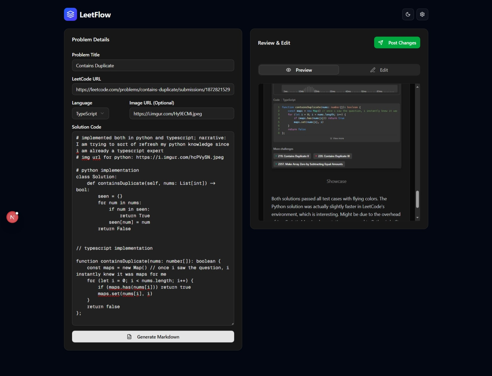
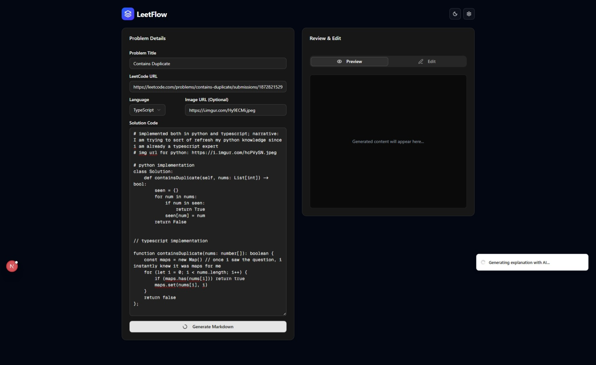

# 🌊 LeetFlow

> **Turn your LeetCode grind into a content engine.**
> Automatically generate high-quality explanations for your solutions and thread them on Twitter/X to build your #BuildInPublic streak.



## 🚀 Features

- **🤖 AI-Powered Explanations**: Uses client-side AI (Puter.js) to turn raw code into "Developer Diary" style walkthroughs.
- **🧵 Smart Threading**: Automatically finds your last tweet and replies to it, keeping your 100-day streak in a single continuous thread.
- **📦 Gist Backup**: Instantly publishes your solution and explanation to GitHub Gists for permanent storage.
- **🎨 Beautiful UI**: Built with Next.js 15, Shadcn UI, and Framer Motion for a premium dark-mode experience.
- **⚡ Review & Edit**: Full control to tweak the AI's output before it goes live.

## 🛠️ Tech Stack

- **Frontend**: Next.js 15 (App Router), React 19, TailwindCSS v4.
- **UI & Animation**: Shadcn UI, Framer Motion, Lucide Icons.
- **AI**: Puter.js (Client-side LLM).
- **Automation**: Python scripts (Tweepy, Requests) for robust API handling.

## ⚡ Quick Start

### 1. Clone & Install

```bash
git clone https://github.com/davistar21/leetflow.git
cd leetflow
npm install
```

### 2. Configure Environment

Create a `.env` file in the root directory (copy from `.env.example`).

```env
# Twitter/X API (Requires Read/Write permissions)
TWITTER_API_KEY=your_key
TWITTER_API_SECRET=your_secret
TWITTER_ACCESS_TOKEN=your_token
TWITTER_ACCESS_TOKEN_SECRET=your_token_secret

# GitHub (For Gists)
GITHUB_TOKEN=your_github_pat
```

> **Note on Twitter Setup**: You must enable **Read and Write** permissions in the Twitter Developer Portal and **regenerate** your tokens afterwards.

### 3. Run Locally

```bash
npm run dev
```

Open [http://localhost:3000](http://localhost:3000).

## 📖 Usage Guide

1.  **Solve**: Paste your LeetCode solution into the input form.
2.  **Generate**: Click "Generate Markdown" to get a structured explanation.
3.  **Refine**: Edit the content in the "Review" tab. Add your own flair!
4.  **Ship**: Click "Post Changes".
    - LeetFlow creates a public Gist.
    - LeetFlow appends a tweet to your daily thread with the Gist link.



## 🤝 Contributing

Open source is awesome! If you want to add support for other platforms (LinkedIn? Dev.to?) or improve the AI prompts:

1.  Fork the repo.
2.  Create a feature branch (`git checkout -b feature/amazing-feature`).
3.  Commit your changes.
4.  Open a Pull Request.

## 📜 License

Distributed under the MIT License.
